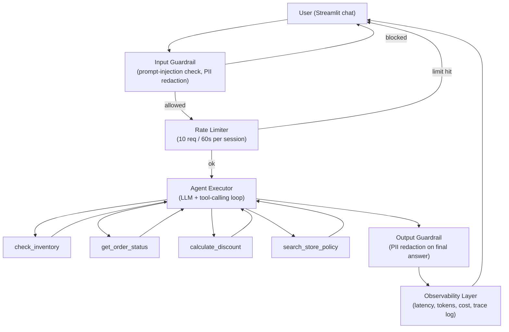

# Store Ops Concierge — LangChain Agent Hands-On Lab

A hands-on LangChain **AI Agent** lab for a retail training workshop. Trainees
who have already completed the RAG assistant and Guardrails/Observability
hands-ons will extend that knowledge into **tool-using agents**: an LLM that
reasons about which of several tools to call, calls them, and returns a
guarded, observed answer through a Streamlit chat UI.

No database, no vector store, no external services required — everything
runs in-memory so the lab has zero infrastructure setup.

---

## 1. What this agent does

The **Store Ops Concierge** answers retail-operations questions by choosing
from four tools:

| Tool | Purpose |
|---|---|
| `check_inventory(sku, store_id)` | Stock level lookup for a SKU at a store |
| `get_order_status(order_id)` | Order status/delivery lookup |
| `calculate_discount(customer_tier, cart_total)` | Loyalty discount math, capped by policy |
| `search_store_policy(query)` | Keyword search over return/discount/store-hours policy docs |

The agent decides **which tool(s)** to call based on the user's question,
calls them, and synthesizes a final answer — this is the core "agent" pattern
(as opposed to a single-shot RAG query or a hardcoded chatbot flow).

---

## 2. Architecture



**Data flow, step by step:**

1. The user types a message in the Streamlit chat box.
2. **Input guardrail** (`guardrails.input_guard`) scans for prompt-injection
   phrasing (e.g. "ignore previous instructions") and redacts any PII the
   user pasted in. Injection attempts are blocked before reaching the LLM.
3. **Rate limiter** (`guardrails.RateLimiter`) enforces a sliding-window cap
   per browser session so a single user can't hammer the agent (and, in a
   real deployment, run up LLM cost).
4. **Agent Executor** (LangChain `create_tool_calling_agent` +
   `AgentExecutor`) sends the system prompt + conversation + user message to
   the LLM. The LLM decides whether to call one or more tools, and the
   executor loops: call tool → feed result back to the LLM → repeat until a
   final answer is produced (or `max_iterations` is hit, which prevents
   infinite tool-call loops).
5. **Tools** (`tools.py`) each read only the in-memory data they need
   (`data.py`) and return structured text. `calculate_discount` enforces the
   `MAX_DISCOUNT_PCT` ceiling in code — never relying on the LLM to "remember"
   the policy — a best-practice defense-in-depth pattern.
6. **Output guardrail** (`guardrails.output_guard`) redacts any PII that
   leaked into the final answer (e.g. a customer email pulled from an order
   record) before it's shown to the user.
7. **Observability** (`observability.ObservabilityHandler`) is a LangChain
   callback handler attached to the executor invocation. It records every
   LLM call and tool call with latency, an approximate token count, and an
   illustrative cost estimate, plus every guardrail action. This is
   rendered live in the Streamlit sidebar as a trace log.

---

## 3. Code structure

```
store-ops-concierge-agent/
├── data.py            # In-memory inventory/orders/customers/policy "database"
├── tools.py            # The 4 LangChain @tool functions the agent can call
├── guardrails.py       # Input/output guardrails + PII redaction + rate limiter
├── observability.py    # LangChain callback handler: trace events, latency, cost
├── agent.py            # System prompt + agent/executor wiring + run_agent() entrypoint
├── app.py              # Streamlit UI (chat + sidebar: guardrails/observability/trace)
├── requirements.txt
├── .env.example         # Copy to .env and add your OPENAI_API_KEY
├── README.md            # This file (architecture/flow/code)
└── USAGE.md             # Step-by-step guide + sample & adversarial prompts
```

### Why this structure (best practices)

- **Separation of concerns**: data, tools, guardrails, observability, and
  agent wiring are separate modules — each can be tested, replaced, or
  extended (e.g. swap `data.py` for a real DB) independently.
- **Least privilege tools**: each tool only reads the specific in-memory
  table it needs and returns a clear "not found" instead of letting the
  model guess missing data.
- **Defense in depth**: the discount ceiling is enforced in `tools.py` code,
  not just described in the system prompt — so even if a prompt-injection
  attempt slipped past the input guardrail, the tool itself can't be talked
  into exceeding policy.
- **Guardrails are structural, not just prompted**: `input_guard`/
  `output_guard` run outside the LLM call, so they can't be argued with or
  bypassed by clever phrasing the way a "please don't do X" instruction can.
- **Observability is pluggable**: `ObservabilityHandler` implements
  LangChain's standard `BaseCallbackHandler` interface, so it can be swapped
  for LangSmith or an OpenTelemetry exporter with no changes to `agent.py`.
- **max_iterations on the executor** prevents an agent from looping
  indefinitely between tool calls — an important safety/cost control.

---

## 3a. A note on LangChain versions

This lab targets recent LangChain releases (v1.x) where the classic
`AgentExecutor` / `create_tool_calling_agent` APIs moved out of `langchain.agents`
into the separate **`langchain-classic`** package (hence it's listed explicitly
in `requirements.txt`). We use the classic API here because it's still the most
widely documented "agent + tools" teaching pattern. If you want to teach the
newer LangGraph-based API instead, swap `agent.py`'s executor construction for
`langchain.agents.create_agent(model=..., tools=..., middleware=[...])` — the
`tools.py`, `guardrails.py`, and `data.py` modules stay unchanged either way.

## 4. Extending this lab

- Swap `data.py` for a SQLite file or real API without touching `tools.py`'s
  function signatures.
- Replace `search_store_policy`'s keyword search with the embeddings/vector
  store from the earlier RAG hands-on for true semantic retrieval.
- Swap `ObservabilityHandler` for a `LangSmith` tracer (just set
  `LANGCHAIN_TRACING_V2=true` and `LANGCHAIN_API_KEY` env vars and pass the
  LangSmith callback instead).
- Add a human-in-the-loop confirmation step before any tool marked
  "high risk" (there are none in this lab, but it's a natural next lesson).

See **USAGE.md** for how to run it and a set of prompts to test.
