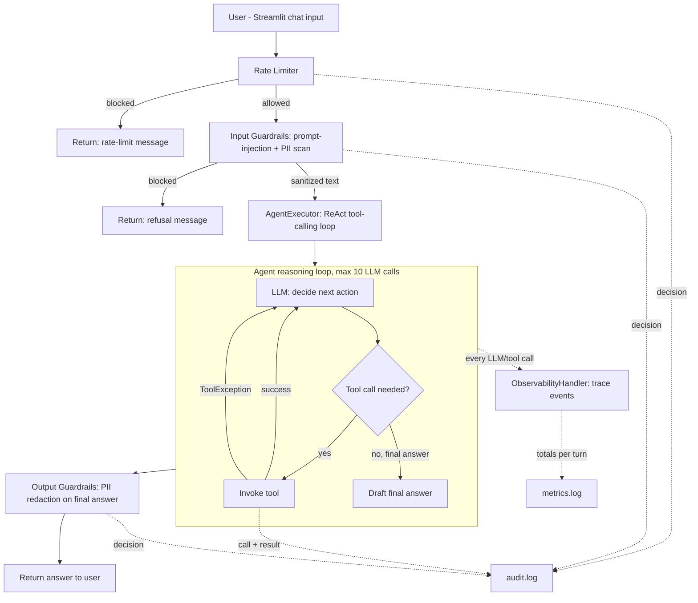

# Store Ops Concierge — Architecture

This document goes deeper than the README's high-level diagram. It explains
*why* each layer exists, how requests flow through the system end to end,
and the specific design decisions a trainer can call out during the
hands-on (guardrail placement, retry semantics, observability wiring, and
the LLM-call ceiling).

## 1. System overview

Every user turn passes through four ordered gates before an answer is shown:

1. **Rate limiter** (`guardrails.py::RateLimiter`)
2. **Input guardrails** (`guardrails.py::input_guard`)
3. **Agent reasoning + tool-calling loop** (`agent.py` + `tools.py`)
4. **Output guardrails** (`guardrails.py::output_guard`)

Guardrails 1, 2, and 4 run in plain Python **outside** the LLM's control —
this is the core "defense in depth" lesson of the lab: never rely on the
system prompt alone to enforce safety or business rules, because a
sufficiently adversarial prompt can talk a model out of following
instructions, but it cannot talk its way past code that runs regardless of
what the model outputs.

## 2. Why guardrails are layered outside the agent, not just in the prompt

| Guardrail | Where it lives | Why here, not just in the system prompt |
|---|---|---|
| Rate limiting | Before the agent even starts | An LLM call is the expensive/slow step; reject early to save cost and latency. Also can't be "talked around" since it never sees the LLM. |
| Prompt-injection detection | Before the agent starts, on raw user text | Must catch "ignore previous instructions"-style attacks *before* they ever reach the model's context window. |
| PII redaction (input) | Same pass as injection detection | If a user pastes a credit card number, it should never even enter the prompt sent to the LLM/provider. |
| Discount policy ceiling | Inside `calculate_discount` (code, not prompt) | The system prompt *asks* the model to respect the 25% cap, but `tools.py` clamps the rate in Python (`rate = min(rate, MAX_DISCOUNT_PCT)`) so the ceiling holds even if the model is convinced to try higher. |
| PII redaction (output) | After the agent produces `output`, before it's shown | Tool results (e.g. order lookups) legitimately contain email/phone data the agent needs to reason about, but the *final answer* to the user must never repeat it verbatim. |

This is why the lab has both an `input_guard` and an `output_guard`: the
input pass protects the model itself (injection, inbound PII), and the
output pass protects the *user-facing answer* (outbound PII), even though
the tools were allowed to see the raw data internally.

## 3. The agent reasoning loop (ReAct via `create_tool_calling_agent`)

`agent.py::build_agent_executor()` wires:

- an OpenAI chat model (`ChatOpenAI`, default `gpt-4o-mini`, `temperature=0`
  for reproducible workshop demos),
- the 4 tools in `tools.py` (`ALL_TOOLS`),
- a `ChatPromptTemplate` with a `system` message (business rules + scope),
  optional `chat_history`, the current `human` input, and an
  `agent_scratchpad` placeholder (where LangChain injects prior
  tool-call/tool-result pairs so the model can see what it already tried).

`create_tool_calling_agent` + `AgentExecutor` implement the classic
"Reason → Act → Observe" loop:

1. The model is called with the conversation + scratchpad so far.
2. It either calls a tool (emits a tool-call message) or produces a final
   answer.
3. If it called a tool, `AgentExecutor` runs it, appends the result to the
   scratchpad as an "observation", and loops back to step 1.
4. This repeats until the model stops calling tools, or `max_iterations` is
   reached.

### 3.1 The 10-call ceiling

`AgentExecutor(max_iterations=MAX_LLM_CALLS)` (currently 10, defined once in
`observability.py` and imported into `agent.py` so the UI and the executor
never drift out of sync) hard-stops the loop after 10 LLM calls in a single
turn. This exists to bound cost/latency and to give trainees a concrete,
observable failure mode: ask a deliberately ambiguous or impossible request
and watch the sidebar's "LLM calls (this turn)" counter hit `10 / 10` and
the executor return its best-effort partial answer instead of looping
forever.

### 3.2 Multi-tool turns

Nothing about the loop restricts it to one tool call per turn — the model
can (and, for compound questions, should) call multiple different tools
across multiple iterations before answering. See `USAGE.md` section 6 for
worked examples where the agent calls 2 or even 3 different tools
(`check_inventory` + `search_store_policy`, or `get_order_status` +
`search_store_policy` + `check_inventory`) to satisfy one user request.
The bottom-of-page "Tool Calls by Agent" panel and `logs/audit.log` both
record every tool call in order, which is what lets you show trainees the
exact sequence the agent chose.

### 3.3 Tool-failure recovery (retry semantics)

`AgentExecutor(max_iterations=MAX_LLM_CALLS, handle_parsing_errors=True)`,
combined with `handle_tool_error=True` set on every tool in `tools.py`,
changes what happens when a tool raises: instead of the exception
propagating up and crashing `executor.invoke()`, LangChain catches it at the
tool level and feeds the error text back into the scratchpad as the
"observation" for that tool call. From
the model's point of view, a tool error looks just like any other
observation — text it can reason about. Combined with system-prompt rule 7
("if a tool call returns an error... retry the same tool call once before
falling back to an apology"), this means:

- No custom retry loop exists in `agent.py`. The retry is emergent behavior
  from (a) every tool having `handle_tool_error=True` set (in `tools.py`,
  right after `ALL_TOOLS` is defined) so the executor doesn't crash on tool
  errors, and (b) the system prompt nudging the model to try again.
- `tools.py::get_order_status` simulates exactly this scenario: the first
  call for order `ORD5002` in a given process raises a `ToolException`
  ("service timed out"); every subsequent call (including the automatic
  retry in the same turn) succeeds. This is deliberately module-level state,
  not per-request state, so the demo is easy to reason about and easy to
  re-arm (the sidebar's "Reset tool-failure demo" button clears it).
- Because both the failed attempt and the successful retry are separate
  `on_tool_start`/`on_tool_end`/`on_tool_error` callback events, both show up
  as distinct entries in the trace log, the "Tool Calls by Agent" panel, and
  `logs/audit.log` — so a trainee can see the agent "resume from the step it
  failed at" rather than restarting the whole turn.

## 4. Observability pipeline

`observability.py::ObservabilityHandler` is a LangChain `BaseCallbackHandler`
passed into `executor.invoke(..., config={"callbacks": [obs_handler]})`. It
listens to the same lifecycle events LangChain already emits internally, so
no application code has to manually instrument each tool or LLM call:

| Callback | Captures |
|---|---|
| `on_llm_start` | Start timestamp + an estimated input-token count computed from the **actual prompts** passed to the model (fixes the earlier bug where the whole `LLMResult` object was stringified and produced a nonsensical token count). |
| `on_llm_end` | Latency, output text (for display), output-token estimate from the real completion text, and estimated cost (illustrative pricing constants, not live billing). |
| `on_tool_start` / `on_tool_end` | Which tool, its input, its output, and latency. |
| `on_tool_error` | Same as above but records the exception text as the "output" — this is how failed-then-retried tool calls both show up in the trace. |

Every `TraceEvent` is tagged with `agent_name` (currently always
`"Store Ops Concierge"` since this lab has one agent, but the field exists
so a multi-agent extension can attribute each tool call to the specific
sub-agent that made it — see `tool_call_summaries()` and the "Tool Calls by
Agent" UI panel).

`ObservabilityHandler.totals()` aggregates the whole turn into: total
latency, total tokens in/out, total estimated cost, tool-call count, and
`total_llm_calls` (paired with the `MAX_LLM_CALLS` ceiling for the "X / 10"
sidebar metric).

## 5. Audit vs. metrics logs — two different jobs

- **`logs/audit.log`** — a forensic, human-readable trail: *what happened,
  in order, and why*. Every guardrail decision (fired or not, and its exact
  reason string), every tool call (agent + tool + detail), and the final
  response are appended as JSON lines with a timestamp and session ID. This
  answers "why did the agent do X" after the fact.
- **`logs/metrics.log`** — one row per completed turn with just the
  numbers: latency, tokens, cost, tool-call count, which guardrails fired.
  This answers "how is the system performing" in aggregate (see USAGE.md's
  exercise on computing average latency/cost across turns).

Both are append-only JSON Lines files under `store-ops-concierge-agent/logs/`,
created on first run and intentionally excluded from git (`.gitignore`) so
each trainee gets a clean log per workshop session.

## 6. Data layer

Everything in `data.py` is an in-memory Python list of dicts — deliberately
not a database, so the lab has zero infrastructure setup. Tool functions in
`tools.py` are written against these lists but only via narrow, single-
purpose functions (`check_inventory`, `get_order_status`,
`calculate_discount`, `search_store_policy`), so swapping in SQLite/Postgres
later only requires changing the *implementation* of those functions, not
their signatures, the agent wiring, or the guardrail/observability layers.

## 7. UI layer

`app.py` is a thin Streamlit shell around `agent.py::run_agent()`. It holds
no business logic — it only renders whatever `run_agent()` returns
(`allowed`, `final_answer`, `guard_events`, `trace_events`, `totals`,
`workflow_steps`, `tool_calls`) into: a sidebar (setup, guardrail events,
observability metrics, trace log) and two bottom-of-page panels (tool-call
attribution, plain-English workflow narration). The dark theme is applied
two ways: `.streamlit/config.toml` sets Streamlit's native dark theme
(base colors, font), and a small `st.markdown(..., unsafe_allow_html=True)`
CSS block adds the hero badge/title/footer styling that isn't exposed by
Streamlit's theme system.
